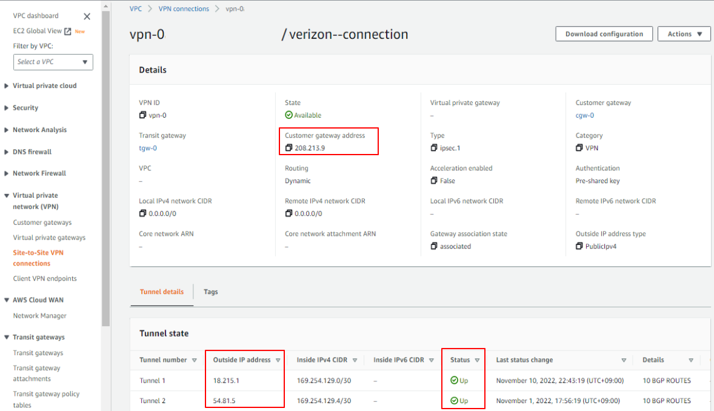
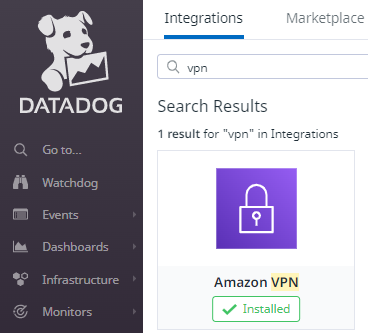
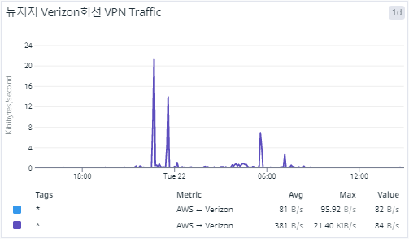
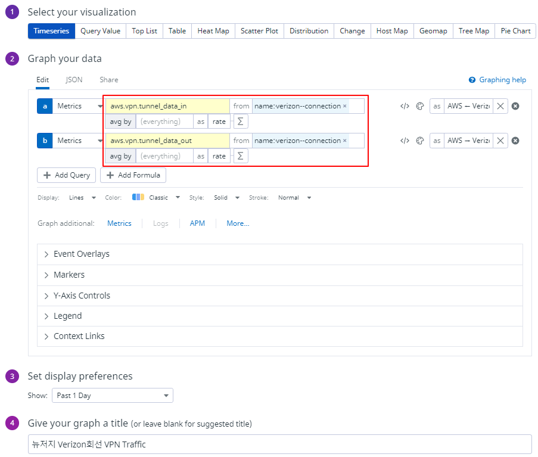

# Datadog Dashboard for AWS VPN Site

## AWS: Site2Site VPN Connections
1. AWS Customer Gateway 등록 후
2. Site to Site VPN Connection 생성
3. Tunnel IP로 등록 Customer VPN과 연결(Connected) 상태

## Datadog: AWS Integration

## Datadog: AWS VPN Dashboard Graph

# Datadog: AWS VPN Dashboard Settings

